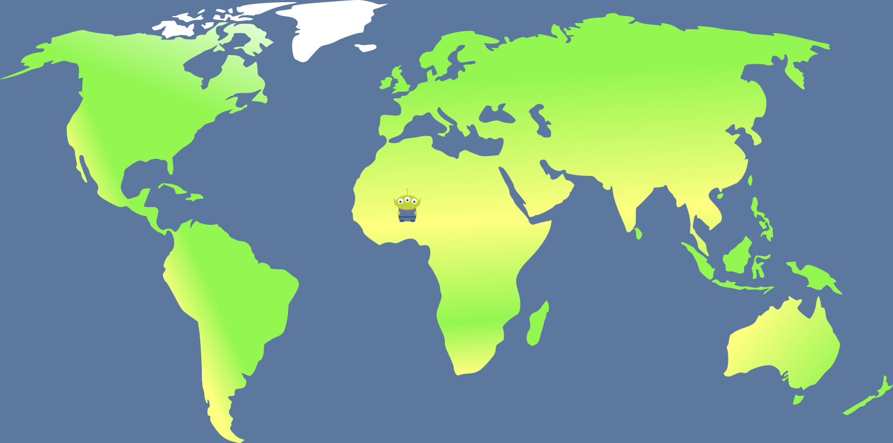

## Projeto da matéria de Prática Profissional 2º Semestre
# Este projeto visa ensinar sobre conflitos históricos de modo interativo, onde será possivel a movimentação sobre um mapa;
- Nos pontos em que tiveram conflitos, como guerras, será exibido na tela informações referentes a esse conflito;
- Usando PDO 
- JavaScript
- Ajax
- Canvas
- PHP
- MySql
- Jquery

